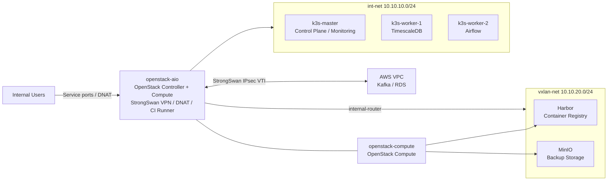

# Baro Private Cloud

온프레미스 OpenStack과 AWS를 Site-to-Site VPN으로 연결하고, OpenStack VM 위의 K3s 클러스터에서 데이터 저장, 분석, 모니터링 서비스를 운영하는 하이브리드 인프라 프로젝트입니다.

이 저장소는 기존 운영 리소스를 Terraform state로 가져와 선언적으로 관리하며, OpenStack 리소스와 K3s Helm 릴리스를 분리해 배포합니다.

## Architecture



### Main Components

| Layer | Component | Role |
|---|---|---|
| Physical | `openstack-aio` | OpenStack controller/compute, VPN gateway, DNAT gateway, GitHub Actions runner |
| Physical | `openstack-compute` | Compute node for Harbor and backup workloads |
| OpenStack | `int-net` | K3s node network |
| OpenStack | `vxlan-net` | Harbor and MinIO network |
| K3s | `k3s-master` | Control plane, Prometheus, Grafana |
| K3s | `k3s-worker-1` | TimescaleDB and database backup workload |
| K3s | `k3s-worker-2` | Apache Airflow |
| AWS | Kafka / RDS | Public-cloud data source and managed database |

## Network Flow

### External Service Access

K3s의 Traefik과 ServiceLB는 비활성화되어 있습니다. 외부 서비스 접근은 메인 서버의 iptables DNAT와 K3s NodePort를 사용합니다.

```text
Client
  -> openstack-aio
  -> iptables DNAT
  -> K3s NodePort
  -> Service / Pod
```

Harbor와 MinIO는 `vxlan-net`에 있으며 `internal-router`를 통해 접근합니다.

```text
openstack-aio
  -> br-ex
  -> internal-router
  -> vxlan-net
  -> Harbor / MinIO
```

### AWS Connectivity

StrongSwan VTI 터널이 온프레미스와 AWS VPC를 연결합니다.

```text
K3s or openstack-aio
  -> VTI route
  -> StrongSwan IPsec
  -> AWS VPC
  -> Kafka / RDS
```

PostgreSQL `5432` DNAT에는 메인 서버 목적지 조건이 적용되어, 온프레미스 TimescaleDB 접근과 AWS RDS 접근이 충돌하지 않도록 구성되어 있습니다.

## Managed Resources

### OpenStack

[`terraform/openstack`](terraform/openstack)은 다음 리소스를 관리합니다.

- Networks and subnets
- Internal router and subnet route
- Fixed-IP ports
- Security group and rules
- Flavors
- Boot-from-volume instances
- Cinder volumes

| VM | Placement | Workload |
|---|---|---|
| `k3s-master` | `openstack-aio` | K3s control plane and monitoring |
| `k3s-worker-1` | `openstack-aio` | TimescaleDB |
| `k3s-worker-2` | `openstack-aio` | Airflow |
| `harbor` | `openstack-compute` | Container registry |
| `backup` | `openstack-compute` | MinIO backup storage |

### K3s Helm Releases

[`terraform/k3s`](terraform/k3s)은 다음 Helm 릴리스를 관리합니다.

| Release | Namespace | Purpose |
|---|---|---|
| `monitoring` | `monitoring` | kube-prometheus-stack, Grafana, Prometheus |
| `timescaledb` | `database` | PostgreSQL 17-based TimescaleDB |
| `airflow` | `airflow` | Data workflow orchestration |

Airflow는 TimescaleDB 이후 설치되도록 Terraform dependency가 설정되어 있습니다.

## Backup Strategy

MinIO가 백업 저장소로 사용되며 백업 파일은 3일간 보존됩니다.

| Target | Method | Schedule |
|---|---|---|
| TimescaleDB | K3s CronJob, `pg_dump`, gzip, MinIO upload | Daily |
| K3s SQLite | Master-node cron, gzip, MinIO upload | Daily |
| Terraform state | Host cron, OpenStack/K3s state copy, MinIO upload | Daily |
| Harbor | Bucket reserved; backup workflow not yet enabled | Not configured |

백업 작업과 MinIO lifecycle 설정은 현재 Terraform 관리 범위 밖에 있습니다.

## Repository Layout

```text
.
|-- .github/workflows/
|   `-- terraform.yml          # Terraform CI/CD workflow
|-- docs/                      # Reference and operation documents
|-- manifests/                 # Manually managed Kubernetes manifests
|-- scripts/                   # Host networking and operation scripts
`-- terraform/
    |-- openstack/             # OpenStack resources
    `-- k3s/
        `-- helm-values/       # Helm values for managed releases
```

## Terraform Usage

### Prerequisites

- Terraform 1.5 or newer
- Access to the OpenStack API
- Access to the K3s kubeconfig
- Existing OpenStack and Helm resources imported into Terraform state
- Required secrets provided through environment variables or ignored `.tfvars` files

### OpenStack

```bash
cd terraform/openstack
terraform init
terraform fmt -check -recursive
terraform validate
terraform plan
```

### K3s Helm Releases

```bash
cd terraform/k3s
terraform init
terraform fmt -check -recursive
terraform validate
terraform plan
```

Do not run `terraform apply` until the plan has been reviewed for unexpected create, replace, or destroy operations.

## State Management

OpenStack and K3s use separate local backend state files on the self-hosted runner.

```text
/home/baro/terraform-state/openstack/terraform.tfstate
/home/baro/terraform-state/k3s/terraform.tfstate
```

State files can contain sensitive values and must never be committed. The backend directories must be backed up separately.

## CI/CD

The GitHub Actions workflow detects changes by Terraform directory and runs only the relevant job.

```text
Path detection
  -> terraform fmt -check
  -> terraform init
  -> terraform validate
  -> terraform plan
  -> terraform apply on main push
```

Terraform 작업은 `self-hosted`, `linux`, `x64`, `openstack` 라벨을 가진 runner에서 실행되며, 필요한 인증 정보는 GitHub Actions Secrets로 전달됩니다.

## Operational Boundaries

Terraform manages OpenStack resources and Helm releases. The following host-level or operational settings remain manually managed:

- StrongSwan and VTI configuration
- iptables DNAT rules
- `br-ex` recovery and host routes
- K3s node labels
- TimescaleDB backup CronJob
- K3s SQLite backup cron
- Terraform state backup cron
- OS packages and Docker installation

## Security

- Never commit `.tfvars`, state files, kubeconfig files, private keys, passwords, or tokens.
- Review every Terraform plan before applying it.
- Treat workflow changes as infrastructure changes because the self-hosted runner can reach production resources.
- Rotate credentials immediately if they are exposed in Git history or logs.

## Known Operational Notes

- TimescaleDB uses an automatically allocated NodePort because the current chart does not expose a configurable NodePort value. Reinstallation may require restoring the expected NodePort or updating the DNAT rule.
- StrongSwan policy routes in Linux routing table 220 can conflict with VTI routes. Host scripts remove conflicting policy routes when tunnels change.
- `br-ex`, DNAT rules, and host routes are restored after reboot by host-level systemd scripts.
