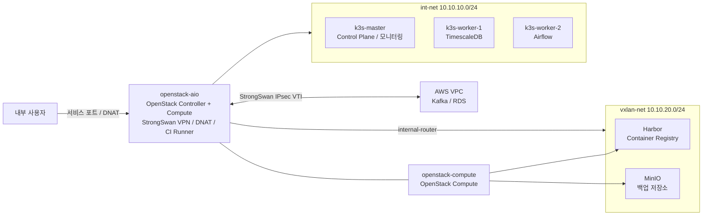

# Baro Private Cloud

온프레미스 OpenStack과 AWS를 Site-to-Site VPN으로 연결하고, OpenStack VM 위의 K3s 클러스터에서 데이터 저장, 분석, 모니터링 서비스를 운영하는 하이브리드 인프라 프로젝트입니다.

이 저장소는 기존 운영 리소스를 Terraform state로 가져와 선언적으로 관리하며, OpenStack 리소스와 K3s Helm 릴리스를 분리해 배포합니다.

## Architecture



### Main Components

| 계층 | 구성 요소 | 역할 |
|---|---|---|
| Physical | `openstack-aio` | OpenStack controller/compute, VPN 및 DNAT gateway, GitHub Actions runner |
| Physical | `openstack-compute` | Harbor와 백업 서비스를 실행하는 compute node |
| OpenStack | `int-net` | K3s node용 network |
| OpenStack | `vxlan-net` | Harbor와 MinIO용 network |
| K3s | `k3s-master` | Control plane, Prometheus, Grafana 운영 |
| K3s | `k3s-worker-1` | TimescaleDB 및 데이터베이스 백업 실행 |
| K3s | `k3s-worker-2` | Apache Airflow |
| AWS | Kafka / RDS | Public cloud 데이터 소스 및 관리형 데이터베이스 |

## Network Flow

### External Service Access

K3s의 Traefik과 ServiceLB는 비활성화되어 있습니다. 외부 서비스 접근은 메인 서버의 iptables DNAT와 K3s NodePort를 사용합니다.

```text
클라이언트
  -> openstack-aio
  -> iptables DNAT
  -> K3s NodePort
  -> Service / Pod
```

Harbor와 MinIO는 `vxlan-net`에 있으며 `internal-router`를 통해 접근합니다.

```text
openstack-aio
  -> br-ex
  -> internal-router
  -> vxlan-net
  -> Harbor / MinIO
```

### AWS Connectivity

StrongSwan VTI 터널이 온프레미스와 AWS VPC를 연결합니다.

```text
K3s 또는 openstack-aio
  -> VTI route
  -> StrongSwan IPsec
  -> AWS VPC
  -> Kafka / RDS
```

PostgreSQL `5432` DNAT에는 메인 서버 목적지 조건이 적용되어, 온프레미스 TimescaleDB 접근과 AWS RDS 접근이 충돌하지 않도록 구성되어 있습니다.

## Managed Resources

### OpenStack

[`terraform/openstack`](terraform/openstack)은 다음 리소스를 관리합니다.

- Network 및 subnet
- Internal router 및 subnet route
- 고정 IP port
- Security group 및 rule
- Flavor
- Boot-from-volume instance
- Cinder volume

| VM | 배치 위치 | 역할 |
|---|---|---|
| `k3s-master` | `openstack-aio` | K3s control plane 및 모니터링 |
| `k3s-worker-1` | `openstack-aio` | TimescaleDB |
| `k3s-worker-2` | `openstack-aio` | Airflow |
| `harbor` | `openstack-compute` | Container registry |
| `backup` | `openstack-compute` | MinIO 백업 저장소 |

### K3s Helm Releases

[`terraform/k3s`](terraform/k3s)은 다음 Helm 릴리스를 관리합니다.

| Release | Namespace | 용도 |
|---|---|---|
| `monitoring` | `monitoring` | kube-prometheus-stack, Grafana, Prometheus |
| `timescaledb` | `database` | PostgreSQL 17 기반 TimescaleDB |
| `airflow` | `airflow` | 데이터 workflow 실행 및 관리 |

Airflow는 TimescaleDB 이후 설치되도록 Terraform dependency가 설정되어 있습니다.

## Backup Strategy

MinIO가 백업 저장소로 사용되며 백업 파일은 3일간 보존됩니다.

| 백업 대상 | 방식 | 실행 주기 |
|---|---|---|
| TimescaleDB | K3s CronJob, `pg_dump`, gzip 압축, MinIO 업로드 | 매일 |
| K3s SQLite | Master node cron, gzip 압축, MinIO 업로드 | 매일 |
| Terraform state | Host cron, OpenStack/K3s state 복사, MinIO 업로드 | 매일 |
| Harbor | Bucket만 생성되어 있으며 백업 작업은 미설정 | 미설정 |

백업 작업과 MinIO lifecycle 설정은 현재 Terraform 관리 범위 밖에 있습니다.

## Repository Layout

```text
.
|-- .github/workflows/
|   `-- terraform.yml          # Terraform CI/CD workflow
|-- docs/                      # 참고 및 운영 문서
|-- manifests/                 # 수동 관리 Kubernetes manifest
|-- scripts/                   # Host network 및 운영 script
`-- terraform/
    |-- openstack/             # OpenStack 리소스
    `-- k3s/
        `-- helm-values/       # 관리 대상 release의 Helm values
```

## Terraform Usage

### Prerequisites

- Terraform 1.5 이상
- OpenStack API 접근 권한
- K3s kubeconfig 접근 권한
- 기존 OpenStack 및 Helm 리소스가 import된 Terraform state
- 환경 변수 또는 Git에서 제외된 `.tfvars` 파일을 통한 필수 secret 설정

### OpenStack

```bash
cd terraform/openstack
terraform init
terraform fmt -check -recursive
terraform validate
terraform plan
```

### K3s Helm Releases

```bash
cd terraform/k3s
terraform init
terraform fmt -check -recursive
terraform validate
terraform plan
```

예상하지 않은 리소스 생성, 교체 또는 삭제가 없는지 plan을 검토한 후 `terraform apply`를 실행해야 합니다.

## State Management

OpenStack과 K3s는 self-hosted runner에서 서로 분리된 local backend state 파일을 사용합니다.

```text
/home/baro/terraform-state/openstack/terraform.tfstate
/home/baro/terraform-state/k3s/terraform.tfstate
```

State 파일에는 민감한 값이 포함될 수 있으므로 Git에 commit하면 안 됩니다. Backend 디렉터리는 별도로 백업해야 합니다.

## CI/CD

GitHub Actions workflow는 Terraform 디렉터리별 변경 사항을 감지하고 관련 작업만 실행합니다.

```text
경로별 변경 사항 감지
  -> terraform fmt -check
  -> terraform init
  -> terraform validate
  -> terraform plan
  -> main push 시 terraform apply
```

Terraform 작업은 `self-hosted`, `linux`, `x64`, `openstack` 라벨을 가진 runner에서 실행되며, 필요한 인증 정보는 GitHub Actions Secrets로 전달됩니다.

## Operational Boundaries

Terraform은 OpenStack 리소스와 Helm release를 관리합니다. 다음 host 및 운영 설정은 수동으로 관리합니다.

- StrongSwan 및 VTI 설정
- iptables DNAT rule
- `br-ex` 복구 및 host route
- K3s node label
- TimescaleDB 백업 CronJob
- K3s SQLite 백업 cron
- Terraform state 백업 cron
- OS package 및 Docker 설치

## Security

- `.tfvars`, state, kubeconfig, private key, password, token 파일은 Git에 commit하지 않습니다.
- 모든 Terraform plan을 검토한 후 apply합니다.
- Self-hosted runner는 운영 인프라에 접근할 수 있으므로 workflow 변경도 인프라 변경으로 간주합니다.
- 인증 정보가 Git 이력이나 log에 노출되면 즉시 교체합니다.

## Known Operational Notes

- 현재 chart에서 NodePort 값을 지정할 수 없어 TimescaleDB는 자동 할당된 NodePort를 사용합니다. 재설치 시 기존 NodePort를 복원하거나 DNAT rule을 갱신해야 할 수 있습니다.
- Linux routing table 220의 StrongSwan policy route가 VTI route와 충돌할 수 있습니다. 터널 변경 시 host script가 충돌하는 policy route를 제거합니다.
- `br-ex`, DNAT rule 및 host route는 재부팅 후 host의 systemd script를 통해 복구됩니다.
