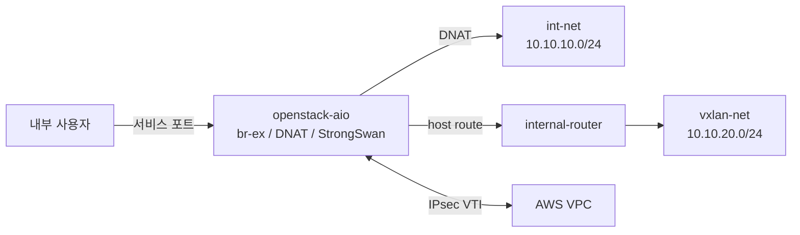

# Network and VPN

## 문서 목적

이 문서는 OpenStack network 외부에서 관리되는 host network, DNAT 및 AWS Site-to-Site VPN 구조를 설명합니다.

## Network 흐름



## `br-ex`와 Host Route

`br-ex`는 Neutron이 생성하는 OVS bridge이며 메인 서버가 `int-net` gateway 역할을 수행하도록 host script에서 IP를 할당합니다.

```text
br-ex: 10.10.10.1/24
```

메인 서버에서 `vxlan-net`으로 접근하기 위한 route:

```text
10.10.20.0/24 via 10.10.10.2 dev br-ex
```

재부팅 시 OpenStack container와 OVS가 먼저 시작된 후, host systemd unit이 `br-ex`와 route를 복구합니다.

## DNAT

K3s의 Traefik과 ServiceLB는 비활성화되어 있습니다. 외부 서비스는 메인 서버의 iptables DNAT를 통해 NodePort 또는 VM 서비스로 전달됩니다.

| 외부 포트 | 대상 | 서비스 | 비고 |
|---:|---|---|---|
| `30300` | `10.10.10.170:30300` | Grafana | K3s NodePort |
| `30900` | `10.10.10.170:30900` | Prometheus | K3s NodePort |
| `30800` | `10.10.10.170:30800` | Airflow | K3s NodePort |
| `5432` | TimescaleDB NodePort | TimescaleDB | 메인 서버 목적지 조건 적용 |
| `8080` | `10.10.20.4:80` | Harbor | VM 서비스 |
| `9001` | `10.10.20.5:9001` | MinIO Console | VM 서비스 |

TimescaleDB의 `5432` DNAT에는 메인 서버 목적지 조건이 필요합니다. 조건이 없으면 AWS RDS로 향하는 PostgreSQL 트래픽도 온프레미스 TimescaleDB로 전달될 수 있습니다.

TimescaleDB NodePort는 chart에서 번호를 직접 지정할 수 없어 재설치 시 변경될 수 있습니다. 변경되면 DNAT 대상도 갱신해야 합니다.

## AWS Site-to-Site VPN

StrongSwan은 VTI 기반 tunnel로 온프레미스와 AWS VPC를 연결합니다.

```text
온프레미스 source
  -> main routing table의 VTI route
  -> StrongSwan IPsec
  -> AWS VPC
```

AWS 목적지 route에는 IPsec traffic selector와 일치하는 source IP가 필요합니다. Route 변경 시 `ip route get <AWS-private-IP>`로 실제 선택 경로와 source를 확인합니다.

## Table 220 충돌

StrongSwan charon은 SA 수립 시 Linux routing table 220에 policy route를 자동 추가할 수 있습니다. Table 220은 main table보다 먼저 평가되므로, 잘못된 route가 있으면 AWS 트래픽이 VTI가 아닌 Wi-Fi default route로 전달됩니다.

### 증상

- VPN tunnel은 `ESTABLISHED`이지만 AWS private endpoint 연결 실패
- `ip route get` 결과가 VTI가 아닌 Wi-Fi interface를 선택
- Table 220에 AWS CIDR route 존재

### 확인

```bash
sudo ipsec statusall
ip rule show
ip route show table 220
ip route show dev vti300
ip route show dev vti400
ip route get <AWS-private-IP>
```

### 현재 대응

Host VPN script는 tunnel 상태 변경 시 충돌하는 table 220 route를 제거합니다. 직접 route를 변경하기 전에는 현재 tunnel과 routing rule을 기록하고 영향 범위를 확인해야 합니다.

## 재부팅 복구 순서

1. Docker와 OpenStack container 시작
2. OVS 및 `br-ex` 생성
3. Host script가 `br-ex` IP, route 및 iptables rule 복구
4. StrongSwan tunnel 및 VTI route 복구
5. 서비스 연결 확인

## 관리 경계

| 대상 | 관리 방식 |
|---|---|
| OpenStack network, subnet, router | Terraform |
| `br-ex` IP 및 host route | Host script와 systemd |
| iptables NAT 및 DNAT | Host script와 systemd |
| StrongSwan, VTI 및 table 220 대응 | Host 설정과 script |
| AWS route table 및 security group | AWS 인프라 관리 영역 |

## 관련 문서

- [OpenStack Private Cloud](openstack-private-cloud.md)
- [K3s Cluster](k3s-cluster.md)
- [Operation Guide](operation-guide.md)
